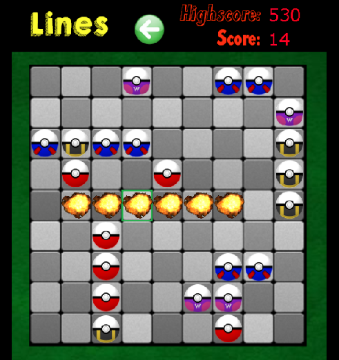

# Lines Game
An implementation of the popular game in HTML5.

### Features:
-  A mobile-first responsive web app
-  Supports mouse and touchscreen interactions
-  Utilizes BFS shortest path algorithm to determine movement
-  Features persistent highscores via localstorage
-  Uses a custom algorithm to perfectly scale graphics to fit the user's device
-  Allows the user to undo the most recent move
-  Written on top of my [2D Game Engine](https://github.com/arenex/2D_Engine)

### How to Play:
- Use mouse (or touchscreen) to select a ball and move it to a different location
- Arrange 5 or more balls of the same colour horizontally, vertically or diagonally to pop them and score points

### Graphics:
- All graphics belong to their appropriate copyright holders
- The material is presented for entirely non-profit educational demo purposes

### Demo
